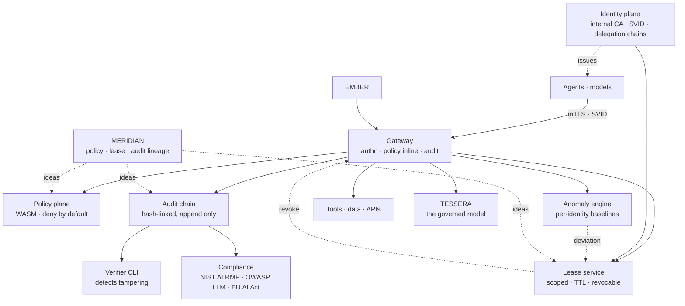

# SYNAPSE-AI — AI Governance Plane

<div align="center">


[](https://github.com/nickemma/synapse-ai/actions)

**Identity, least privilege, time-bound access, and audit — for AI agents, enforced the way enterprises enforce them for people.**

_Every agent is a principal with a short-lived certificate. Every tool call is a policy decision with a trace. Every decision is in a hash-chained log. The threat model is the first commit._

[Threat model](docs/threat-model.md) • [Architecture](#architecture) • [Decisions](docs/decisions/) • [Red team](redteam/) • [Runbook](docs/runbook.md) • [Roadmap](#roadmap)

</div>

---

## Project Status

> **Nothing is built.** This repository contains a design derived from a frozen charter.
> If you clone this expecting a governance plane, you will be disappointed — for now. By construction the first commit here is [`docs/threat-model.md`](docs/threat-model.md), tagged `v0.0.1-threat-model` before any code exists — so "the threat model gated the build" is provable from git history rather than asserted in a README.

| Behavior | State |
|---|---|
| B1 · Threat model exists before any code, and gates it | Not started |
| B2 · CA issues short-lived workload certs; rotation causes no outage | Not started |
| B3 · Per-agent identity; agent-spawns-agent as a delegation chain | Not started |
| B4 · Policy engine denies by default, with a decision trace | Not started |
| B5 · An injection attempting exfiltration is stopped at the tool boundary | Not started |
| B6 · Hash-chained audit log; verifier CLI catches tampering | Not started |
| B7 · Anomaly engine quarantines an agent that deviates from baseline | Not started |
| B8 · Compliance matrix generated from real controls, not prose | Not started |
| B9 · Capstone: agent → lease → gateway → policy → audit, six systems | Not started |
| B10 · Red-team findings published, including the unfixed ones | Not started |

---

## What is SYNAPSE-AI?

Enterprises spent thirty years learning how to govern a human employee. They get an identity that is provably theirs. They get the least privilege that lets them do the job. Access is time-bound and revocable. Every consequential action is logged in a way that survives the actor wanting it gone. Behaviour is baselined, and deviation is investigated.

Then the same organisation hands an autonomous agent a long-lived API key with broad scopes, points it at production, and hopes.

That asymmetry is not a gap in tooling — it is a gap in whether anyone decided agents were principals at all. SYNAPSE-AI closes it by treating every model and agent as a first-class subject of exactly the controls a person would be subject to.

The first bet is **enforcement at the data plane rather than in an SDK.** An SDK that the agent imports is trivially bypassed by the agent, and the agent is the adversary — that is the entire threat. So every tool call and model call goes through a gateway that authenticates the caller, evaluates policy, and writes the audit record. It costs a network hop. Given that the alternative is a control the governed party can decline to use, that is not a close call.

The second bet is that **an identity that expires is a revocation you do not have to be right about.** Agents get SVID-style certificates measured in minutes, not keys measured in quarters. Revocation still exists and still propagates, but the failure mode of missing a revocation is bounded by the TTL rather than unbounded by whoever forgets to rotate. When an agent spawns another agent, the child gets its own identity and a recorded delegation chain — never the parent's credential — so "which agent did this, and who authorised it to exist" has an answer.

The third bet is **deny by default, with a decision trace.** A subject with no matching policy can do nothing. Every allow is a positive decision recording identity, tool, data class, context, the policy version that produced it, and the reason — so an incident investigation is a query rather than an archaeology project.

The fourth is stated precisely because the industry blurs it: **the audit log is tamper-evident, not tamper-proof.** Hash chaining lets you *prove* that a record was altered or removed. It does not prevent someone with write access from doing it. Any product claiming otherwise is either replicating to somewhere you don't control or lying, and this one does the former for the subset of controls where it matters and says so plainly for the rest.

**The real question this system answers:** an agent exfiltrated the customer list. Prove which agent, prove it was authorised to read that data class, prove who delegated that authority to it, and prove the log you are reading has not been edited. Most agent deployments cannot answer any of the four.

---

## What Each Layer Proves

| Layer | What It Demonstrates |
|---|---|
| Threat model as the first commit | Security engineering discipline — the model gates the code, provably, from git history |
| Internal CA issuing short-lived SVIDs | PKI and certificate lifecycle at the level where rotation is a design constraint |
| Delegation chains with scope intersection | The confused-deputy problem, in its agent-native form, solved rather than described |
| WASM-sandboxed policy engine | Untrusted policy evaluated safely — security architecture, not a config file parser |
| Deny-by-default with a decision trace | Authorization that can be audited and explained, not just enforced |
| Tool-boundary injection defence | You understand that prompt injection is an authorization problem, not a prompt problem |
| Hash-chained audit with a verifier | Tamper-evidence built and *tested*, with the limits stated honestly |
| Per-identity behavioural baselines | Runtime enforcement beyond static policy, with the false-positive cost owned |
| Controls mapped to framework line items | Compliance as evidence generated from code, not prose written afterward |
| Published red-team findings, including unfixed | Security honesty — the rarest signal in this entire portfolio |

---

## Architecture

> **Design target.** Nothing below exists yet.



SYNAPSE is the convergence flagship: [EMBER](https://github.com/nickemma/ember) is its data plane lineage, [MERIDIAN](https://github.com/nickemma/meridian) is where its policy, lease, and audit engines were first built, and [TESSERA](https://github.com/nickemma/tessera) is the AI it governs. `docs/dependencies.md` pins the exact tag of each it integrates against.

---

## The Signature Flow

```
Agent starts
   ↓
Authenticates                 mTLS with its SVID — no shared secret exists
   ↓
Requests a lease              scope: {tool: crm.read, data_class: pii} ttl: 5m
   ↓                          ← denied here if policy says no; audited either way
Calls a tool through gateway  POST /proxy/tools/crm  (lease presented)
   ↓
Policy evaluation             identity × tool × data_class × context
   ↓                          WASM, deny-by-default, < 5 ms p99
   ├── allow ──→ proxied ──→ audited ──→ response
   └── deny  ──→ blocked ──→ audited ──→ 403 + decision trace
   ↓
Anomaly scoring               deviation from this identity's baseline
   ↓
On deviation                  lease revoked · agent quarantined · alert
```

Every arrow writes an audit record, and the record is written **before** the effect. A log written after the action it describes cannot distinguish "did not happen" from "happened and the logger died."

---

## Trust Boundaries

Four, and every one assumes the thing on the left is hostile:

| # | Boundary | Assumption | Control |
|---|---|---|---|
| 1 | Agent → gateway | The agent is prompt-injected and acting against its operator | mTLS identity, deny-by-default policy, lease scope |
| 2 | Agent → agent | A compromised agent will try to spawn a more privileged one | Delegation chain; a child's scope is intersected with its parent's, never unioned |
| 3 | Policy author → policy engine | A policy may be malicious or simply wrong | WASM sandbox, no host access, versioned and signed policies |
| 4 | Operator → audit log | An insider will edit the record | Hash chain + external anchor; verifier detects breaks |

Boundary 2 is the one people miss. Privilege escalation via delegation is the agent-native confused deputy, and a system that grants children the parent's credential has built it deliberately.

---

## The Four Pillars

### 1. Identity Plane — `cmd/synapse-ca/`, `internal/modules/identity/`

- **Internal CA issuing SVID-style workload certificates** — minutes, not quarters
- **Rotation without outage** — a rotation that requires a restart is a rotation that gets postponed, which is how credentials become permanent
- **Delegation chains** — agent-spawns-agent records the parent, the scope, and the reason; the child never receives the parent's key
- **Scope intersection, never union** — the single function the whole privilege model rests on, in pure Go, property-tested without a CA in sight
- **Zero shared secrets** — there is no static credential to steal, which is a design property rather than a policy

### 2. Policy Plane — `internal/modules/policy/`

- **WASM-sandboxed evaluation** — policies compiled to WebAssembly; a malicious or malformed policy cannot touch the host process
- **Deny by default** — a subject with no matching policy can do nothing; access is explicit grant only
- **Contextual** — identity × tool × data class × time × prior behaviour, evaluated per call
- **Decision traces** — every allow and every deny records the policy version and the reason, so an investigation is a query
- **Versioned and signed** — policy rollback is a first-class operation, not a git revert and a redeploy

### 3. Audit & Compliance — `internal/modules/{audit,compliance}/`, `cmd/synapse-verify/`

- **Hash-chained append-only log** — each record includes the hash of the previous; a break is detectable
- **Verifier CLI** — runs continuously, not on request; a chain break is an alert, not a discovery
- **External anchoring** — periodic chain heads written where the operator cannot reach, for the controls that need it
- **Write before effect** — always, so absence of a record means absence of an action
- **Compliance matrix generated from controls** — NIST AI RMF, OWASP LLM Top 10, EU AI Act, each line item pointing at the control and the test that proves it. Generated, never written by hand

### 4. Runtime Enforcement — `internal/modules/anomaly/`, `internal/gateway/`, `redteam/`

- **Per-identity behavioural baselines** — tool mix, call rate, data classes touched, time-of-day distribution
- **Deviation scoring, method named** — see the honesty note below
- **Quarantine is reversible and audited** — an agent wrongly quarantined is a bug with a paper trail, not a mystery
- **Red-team suite as reproducible tests** — injection exfiltration, audit tampering, partition during renewal, delegation escalation. In the repository as tests, so an attack that once worked can never silently start working again

> **Honesty note on anomaly detection.** In a document that names AES-256-GCM, SPIFFE, and WASM precisely, "ML-powered anomaly detection" would be the one place precision drops out — which reads as the thing the author is least sure of. This system commits to naming the actual method in `docs/decisions/` before the code: the features, the statistic, the threshold, and the false-positive rate it was tuned to. An EWMA over per-identity call-rate features with a z-score threshold is more impressive than "ML," because it is a choice that can be defended.

---

## Tech Stack

| Layer | Technology | Why |
|---|---|---|
| **Everything** | Go 1.25 | Control-plane heavy; static binaries, strong crypto library, the portfolio's primary language |
| **Policy engine** | WASM via wasmtime | Untrusted policy must not reach the host process. Inherited from [MERIDIAN](https://github.com/nickemma/meridian), extended with AI context |
| **Identity** | Internal CA, SPIFFE-style SVIDs | Short-lived certificates make revocation a fallback rather than the primary control |
| **Audit store** | Append-only, hash-chained, on Postgres | The chain is the guarantee; the store is deliberately boring |
| **Key management** | AWS KMS | Root key material should not be in a system that is itself the thing being audited |
| **Data plane** | Gateway in Go, EMBER lineage | The proxy pattern from the first flagship, applied where it matters most |
| **Red team** | Go tests | Attacks as tests, so a regression is a build failure rather than a report |
| **Observability** | Prometheus · Grafana · OpenTelemetry · CloudTrail | Policy latency and revocation propagation are the two numbers that decide the design |

---

## Service Level Objectives

Seeded from charter point 4, scored at level exit. Mirrored in the blueprint's `calibration.md`.

| SLI | Definition | Target | Measured |
|---|---|---|---|
| **Policy evaluation latency** | Added latency per governed call, p99 | < 5 ms | — |
| **Revocation propagation** | Revocation issued → enforced cluster-wide, p99 | < — s | — |
| **Audit verification throughput** | Records verified/sec by the verifier | ≥ real traffic rate | — |
| **Behaviour under partition** | Governed calls allowed when the policy plane is unreachable | **0 — fail closed** | — |
| **Decision reconstructability** | Governed calls with a complete audit record | **100%** | — |
| **Certificate rotation impact** | Agent calls failed during a rotation | **0** | — |
| **Anomaly false-positive rate** | Quarantines reversed on review ÷ total quarantines | < — % | — |

`fail closed` is the row that decides this system's character. Under partition, a governance plane that fails open has, at the exact moment it matters, become a log.

The last row is the honest one: behavioural enforcement that cannot be wrong is behavioural enforcement nobody has measured.

---

## Metrics

| Metric | Type | Labels | Question it answers |
|---|---|---|---|
| `synapse_policy_decisions_total` | counter | decision, policy_version, tool | Is the policy set doing anything, or allowing everything? |
| `synapse_policy_eval_duration_seconds` | histogram | policy_version | Is governance costing what we said it would? |
| `synapse_policy_denials_total` | counter | identity, tool, reason | Is an agent probing, or is a policy wrong? |
| `synapse_lease_issued_total` | counter | identity, scope | Who is asking for what? |
| `synapse_lease_revocations_total` | counter | reason (expiry/anomaly/manual) | Are we revoking on evidence or on schedule? |
| `synapse_revocation_propagation_seconds` | histogram | — | How long is a revoked agent still dangerous? |
| `synapse_cert_issued_total` | counter | kind (agent/model/human) | How many principals actually exist? |
| `synapse_cert_expiry_seconds` | gauge | identity | Which identity is about to fail silently? |
| `synapse_delegation_depth` | histogram | root_identity | Are agents spawning agents deeper than anyone intended? |
| `synapse_audit_records_total` | counter | event_type | Does the record volume match the traffic volume? |
| `synapse_audit_chain_verifications_total` | counter | result | Has the chain ever broken? |
| `synapse_anomaly_score` | gauge | identity | Which agent is behaving unlike itself? |
| `synapse_quarantines_total` | counter | identity, reversed | Is enforcement accurate, or noisy? |
| `synapse_gateway_fail_closed_total` | counter | reason | How often has governance failed shut, and why? |

`synapse_delegation_depth` is the one that catches the interesting incidents. Agents spawning agents four levels deep is not a bug in any single component, and no other metric would show it.

---

## Failure Mode Analysis

| Failure | Blast radius | Detection | Mitigation |
|---|---|---|---|
| Policy engine unreachable | All governed calls | Health check | **Fail closed** — deny and audit; alert immediately |
| Partition during lease renewal | Agents mid-task | Renewal failure rate | Lease expires, calls denied; no grace window, by design |
| CA unavailable | New agents cannot start | Issuance error rate | Running agents unaffected until TTL; issuance queues |
| Malicious WASM policy | Would be the host | Sandbox violation counter | No host access from the sandbox; memory, time and fuel caps |
| Audit chain break | Trust in the whole record | Verifier CLI, run continuously | Alert, freeze writes, reconcile against external anchor |
| Prompt injection → exfiltration attempt | One agent's scope | Policy denial + anomaly score | Denied at the tool boundary; quarantine; audited |
| Delegation-chain escalation | Would be everything | Chain depth + scope-widening check | Child scope intersected with parent, never unioned |
| Anomaly false positive | One agent, wrongly | Quarantine reversal rate | Quarantine reversible and audited; human review path |
| Audit store unavailable | Governed calls | Write-before-effect fails | **Fail closed** — no action without a record. This is a deliberate availability sacrifice |
| Clock skew across nodes | Lease TTL correctness | NTP drift metric | TTLs evaluated against a monotonic source; skew alarmed |

Two rows fail closed. That is the design's stance and its cost: SYNAPSE will sometimes stop legitimate work. A governance plane that prefers availability has chosen not to be a governance plane.

---

## Security as First Principles

- **No standing credentials anywhere** — every principal holds a short-lived certificate; there is no static key to steal, rotate, or forget
- **Enforcement at the data plane, not in an SDK** — the governed party cannot decline to be governed
- **Deny by default** — no matching policy means no access; every allow is an explicit, recorded decision
- **Scope intersection on delegation** — a child agent can never hold authority its parent did not have
- **WASM sandbox for policy** — untrusted evaluation with memory, time, and fuel limits; no host syscalls
- **Write the audit record before the effect** — absence of a record means absence of an action
- **Tamper-evident, not tamper-proof** — the distinction is stated here and in the threat model rather than papered over
- **Root key material in KMS** — outside the system that is itself the subject of the audit
- **Fail closed under partition** — availability is deliberately sacrificed to correctness, twice, and both are documented
- **Red team in the repository** — attacks live as tests so a fixed vulnerability cannot silently return
- **Threat model** in [`docs/threat-model.md`](docs/threat-model.md) — STRIDE per boundary, every control mapped to the test that proves it, and every accepted risk named

---

## Intended Interface

> **Not implemented.** The contract, written before the code — and after the threat model, which gates it.

```bash
# Identity
synapsectl identity create --kind agent --name research-agent
synapsectl identity show --spiffe spiffe://synapse/agent/research-agent
synapsectl delegation tree --root research-agent      # who spawned whom, and with what

# Leases
synapsectl lease grant --identity research-agent \
  --scope 'tool:crm.read,data_class:pii' --ttl 5m
synapsectl lease revoke --id lease_01HQ8 --reason anomaly

# Policy
synapsectl policy push --file policies/crm.wasm --version 7
synapsectl policy explain \
  --identity research-agent --tool crm.read --data-class pii
# → DENY  policy v7  rule "pii_requires_human_approval"  no approval on record

# Audit
synapsectl audit query --identity research-agent --last 24h
synapse-verify --from 2026-07-01 --to 2026-07-30      # chain integrity
# → 1,204,881 records verified · chain intact · anchor match

# Compliance
synapsectl compliance report --framework nist-ai-rmf --format pdf

# Red team (destructive, isolated)
make redteam
```

```protobuf
service GovernanceService {
  rpc RequestLease(LeaseRequest) returns (Lease);
  rpc RevokeLease(RevokeRequest) returns (RevokeResponse);
  rpc ExplainDecision(ExplainRequest) returns (Decision);   // the debuggability contract
  rpc StreamAudit(AuditQuery) returns (stream AuditEvent);
}

message Decision {
  bool     allowed        = 1;
  string   policy_version = 2;
  string   rule           = 3;   // which rule decided, by name
  string   reason         = 4;   // human-readable, for the incident, not the log
  repeated string chain   = 5;   // delegation chain evaluated
  string   audit_id       = 6;   // the record written before this response
}
```

```bash
SYNAPSE_CA_ROOT_KEY_KMS_ARN=arn:aws:kms:…
SYNAPSE_SVID_TTL=15m                        # minutes, not quarters
SYNAPSE_LEASE_DEFAULT_TTL=5m
SYNAPSE_LEASE_MAX_TTL=1h
SYNAPSE_DELEGATION_MAX_DEPTH=3              # depth is an attack surface
SYNAPSE_POLICY_WASM_MEMORY_LIMIT_MB=64
SYNAPSE_POLICY_WASM_FUEL_LIMIT=10000000
SYNAPSE_POLICY_EVAL_TIMEOUT=5ms             # exceeded = deny, never allow
SYNAPSE_FAIL_MODE=closed                    # the only supported value; present to be explicit
SYNAPSE_AUDIT_ANCHOR_INTERVAL=1h
SYNAPSE_AUDIT_ANCHOR_TARGET=s3://…          # write-once bucket, separate account
SYNAPSE_ANOMALY_BASELINE_WINDOW_HOURS=168
SYNAPSE_ANOMALY_AUTO_QUARANTINE=true
SYNAPSE_TESSERA_ENDPOINT=…                  # pinned tag in docs/dependencies.md
```

`SYNAPSE_FAIL_MODE=closed` has exactly one supported value. It exists so that anyone looking for the flag that turns governance off finds the answer immediately.

---

## Layout

<!-- charter:12 - file structure -->

```
synapse-ai/
├── cmd/
│   ├── synapse-api/         control plane — identities, leases, policies
│   ├── synapse-gateway/     data plane — authn, policy inline, audit
│   ├── synapse-ca/          issuance and rotation
│   └── synapse-verify/      audit chain verifier CLI
│
├── api/proto/synapse/v1/
│
├── internal/
│   ├── app/                 composition root — one builder per binary
│   ├── platform/            crypto · wasm host · telemetry · clock · errors
│   │                        (clock injectable — leases and TTLs need it testable)
│   ├── modules/
│   │   ├── identity/        domain: SVID · delegation chain · scope intersection
│   │   ├── lease/           domain: scope · TTL · revocation semantics
│   │   ├── policy/          domain: decision · trace · version
│   │   │                    adapters/wasm: the sandboxed evaluator
│   │   ├── audit/           domain: event · hash chain · anchor
│   │   ├── anomaly/         domain: baseline · deviation · quarantine
│   │   └── compliance/      domain: control · evidence · framework mapping
│   └── gateway/             data plane — authn · policy · audit, inline
│
├── redteam/                 the attack suite, as reproducible tests
│   ├── injection_exfil_test.go
│   ├── audit_tamper_test.go
│   ├── partition_renewal_test.go
│   └── delegation_escalation_test.go
│
├── docs/threat-model.md     THE FIRST COMMIT
└── deploy/                  EKS · KMS · CloudTrail
```

`internal/modules/identity/domain` contains the scope-intersection rule in pure Go, imported by nothing outward — because it is the single function whose correctness the whole privilege model rests on, and it should be property-testable without a certificate authority in sight.

---

## Roadmap

**V1 — Model the threat.** STRIDE across every boundary · attack trees · controls mapped to framework line items · tagged `v0.0.1-threat-model` before any code

**V2 — Give agents identity.** Internal CA · SVID issuance · rotation without outage · mTLS everywhere · delegation chains with scope intersection

**V3 — Decide.** WASM policy engine · deny by default · decision traces · policy versioning and rollback · `explain` as a first-class operation

**V4 — Remember.** Hash-chained audit · verifier CLI · external anchoring · write-before-effect enforced

**V5 — Watch.** Per-identity behavioural baselines · deviation scoring with a named method · reversible, audited quarantine

**V6 — Prove it.** The capstone flow across all six systems · red-team suite run and published · findings fixed or documented as accepted risk

**Deferred, with reasons in [LATER.md](LATER.md):** human identity federation and SSO · ISO 42001 mapping · agent-behaviour forensics · multi-region audit replication · richer anomaly models · policy marketplace

---

## Non-Goals

- **Not enterprise IAM.** Agents and tools. Human identity federation is out of scope and deferred.
- **Not a model safety layer.** SYNAPSE governs what an agent may *do*, not what a model may *say*. Different problem, different system.
- **Not tamper-proof.** Tamper-*evident*. The distinction is stated in the threat model rather than papered over.
- **Not a compliance certification.** The matrix maps controls to line items with evidence. That is a starting point for an auditor, not a substitute for one.
- **Not highly available under partition.** It fails closed, twice, deliberately. If that is unacceptable for your workload, you do not want a governance plane.

---

## Documentation

| Document | Contents |
|---|---|
| [`docs/threat-model.md`](docs/threat-model.md) | STRIDE, trust boundaries, adversaries, controls → tests. **Gates everything** |
| [`docs/architecture.md`](docs/architecture.md) | Containers, components, the signature flow, invariants |
| [`docs/dependencies.md`](docs/dependencies.md) | Pinned tags of EMBER, MERIDIAN, TESSERA this integrates against |
| [`docs/decisions/`](docs/decisions/) | ADRs — every choice and the alternatives that lost |
| [`docs/compliance/`](docs/compliance/) | Generated matrix — NIST AI RMF, OWASP LLM Top 10, EU AI Act |
| [`redteam/`](redteam/) | Attack suite and findings, including what could not be fixed |
| [`docs/runbook.md`](docs/runbook.md) | Signals, symptom → cause → action, revocation and rotation procedures |
| [`LATER.md`](LATER.md) | Scope cut, with reasons |

---

## One Platform, Six Repositories

These are not six projects. **EMBER** fronts everything · **LATTICE** proves the distributed core · **MERIDIAN** provides secrets, policy, lease and audit · **VEYRONIX** consumes MERIDIAN and operates services · **TESSERA** is served behind EMBER and operated like VEYRONIX · **SYNAPSE-AI** governs TESSERA's agents using MERIDIAN's lineage and EMBER's data plane.

[EMBER](https://github.com/nickemma/ember) · [LATTICE](https://github.com/nickemma/lattice) · [MERIDIAN](https://github.com/nickemma/meridian) · [VEYRONIX](https://github.com/nickemma/veyronix) · [TESSERA](https://github.com/nickemma/tessera) · [SYNAPSE-AI](https://github.com/nickemma/synapse-ai)

---

## Author

**[@nickemma](https://github.com/nickemma)** — Building production-grade distributed systems, infrastructure, and platform engineering from first principles.

💼 Open to distributed systems, infrastructure, platform, and backend engineering roles at companies building serious systems.

<div align="center">
<a href="https://www.linkedin.com/in/techieemma/"></a>
<a href="https://twitter.com/techieemma"></a>
<a href="https://github.com/nickemma/"></a>
<a href="https://techieemma.medium.com/"></a>
<a href="mailto:nicholasemmanuel321@gmail.com"></a>
</div>

---

<div align="center">

**Building Systems, Building Faith — One Commit at a Time**

*Part of [The Nicholas Emmanuel Engineering Blueprint](https://github.com/nickemma/Nicholas-Engineering-Blueprint).*

[⬆ Back to Top](#synapse-ai--ai-governance-plane)

</div>
